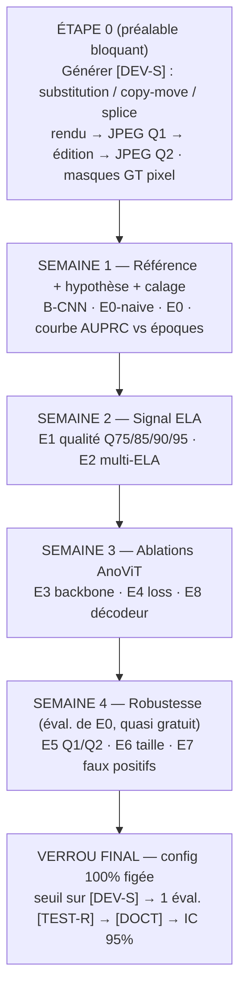

# Schéma récapitulatif — Roadmap mémoire ELA / AnoViT

> Vue synthétique de `plan.md`. **Deux invariants** :
> décision toujours sur le **dev synthétique** ; verrou **test réel** évalué **une seule fois**.

---

## 1. Les trois jeux de données (§5ter, §9.2)

| Jeu | Contenu | Rôle | Règle |
| --- | --- | --- | --- |
| **`[TRAIN]`** | ~10 800 authentiques, split doc **80/20** | Entraînement uniquement | authentiques seuls |
| **`[DEV-S]`** | Synthétique falsifié annoté (Étape 0) | Sélection · ablations · seuil · pilotage early-stop | **usage libre** |
| **`[TEST-R]`** | Réel EY : **50 falsifiés + 50 authentiques** | Test de généralisation | **GELÉ → 1 seule éval.** |
| **`[DOCT]`** | Sous-échantillon DocTamper | Contrôle externe indépendant | bonus, hors chemin critique |

- **Métrique de DÉCISION** (partout) : **Pixel AUPRC** de localisation sur `[DEV-S]` — §9.3bis
- **Métrique finale la plus solide** : **Image AUROC** sur `[TEST-R]` (100 points) — §9.4

---

## 2. Flux global



---

## 3. Détail par étape

### Étape 0 — Préalable bloquant : générer `[DEV-S]`
- Chaîne : **rendu propre → JPEG Q1 → édition locale → JPEG Q2**
- Éditions : substitution `0.34` · copy-move `0.33` · splice `0.33`
- Q1 ~ distribution réelle EY · **Q1 et Q2 paramétrables indépendamment** (clé pour E5)
- Masques GT au pixel · anti-tell : grille 8×8 (aligné/non), feather, cohérence police/couleur
- **Livrable** : `[DEV-S]` versionné + histogramme qualités JPEG réel vs synthétique

### Semaine 1 — Référence, hypothèse, calage

| Expé | Description | Entraîné sur | Sortie |
| --- | --- | --- | --- |
| **B-CNN** | CNN équipe, **non ré-optimisé**, même protocole que E0 | `[TRAIN]`→`[DEV-S]` | comparaison « vs CNN » |
| **E0-naive** | Seuillage ELA Q90 **brute** (aucun modèle) | `[DEV-S]` | borne inférieure |
| **E0** ★ | AnoViT ELA Q90, **config finale** (§5.1/5.2) | `[TRAIN]`→`[DEV-S]` | score = erreur reconstruction |

- **Calage époques (1 fois)** : courbe AUPRC`[DEV-S]` vs époques → justifie plafond=100, patience=15.
  Montée puis plateau/redescente = paradoxe autoencodeur (§4). Checkpoint = **best-detection**, pas le dernier.
- **Livrable** : E0-naive vs B-CNN vs E0 → 1ʳᵉ réponse à la problématique + courbe époques.

### Semaine 2 — Signal ELA
- **E1** — Ablation qualité : réentraîne E0 sur **Q75 / Q85 / Q90 / Q95** (seule la représentation change).
- **E2** — Multi-ELA : entrée = cible = **`[ELA Q75, ELA Q85, ELA Q95]`** (tensor 3 canaux).
- ⚠️ Écarts fins sur `[DEV-S]` = **tendances**, pas verdicts (50 docs au test réel).
- **Livrable** : tableau `Représentation | AUPRC | AUPRO | Dice | IoU | FPR-auth | Commentaire`.

### Semaine 3 — Ablations AnoViT *(chaque expé fait varier UN axe autour de E0)*
- **E3** — Régime backbone : ViT-Base `frozen | fine-tuné | scratch` **+ ViT-Small dans les 3 régimes** (isole le préentraînement, sinon confound taille).
- **E4** — Loss / carte anomalie : `MAE | MSE | SSIM | MAE+SSIM` — décision = **AUPRC`[DEV-S]`** (pas reconstruction, pas test réel).
- **E8** ★ — Décodeur : **original AnoViT vs modifié** (§5.2), encodeur & protocole identiques → valide la contribution architecturale en **localisation**.
- **Livrable** : choix final justifié — backbone/régime · loss · décodeur.

### Semaine 4 — Robustesse forensique *(évaluations de E0 déjà entraîné → quasi gratuit, ne jamais sacrifier)*
- **E5** — Robustesse Q1/Q2 : `Q1>Q2` (recompression forte) · `Q1<Q2` · `Q1=Q2` (dégénéré). Cas `Q2<Q1` écrase le signal → **limite physique**.
- **E6** — Taille falsification : `petite | moyenne | grande | très grande` → le bottleneck 24×24 limite-t-il les petites zones ?
- **E7** — Faux positifs (auth.) : logos · tampons · signatures · couleurs · texte dense · bruit scan · bordures → teste l'hypothèse secondaire (AnoViT réduit-il les FP vs B-CNN ?).
- **Livrable** : tableau Q1/Q2 · perf par taille · analyse qualitative FP · limites honnêtes.

### Verrou final — une seule fois, config 100 % figée (§9.3, §9.5)
1. Seuil calibré sur `[DEV-S]` (max Dice / point de fonctionnement) → sauvegardé.
2. **Évaluation UNIQUE** sur `[TEST-R]` 50/50 → Image AUROC + AUPRC + AUPRO + Dice/IoU/FPR.
3. `[DOCT]` en contrôle externe (bonus).
4. IC 95 % bootstrap niveau document + multi-seed `{42, 1337, 2024}` sur B-CNN vs E0.

---

## 4. Métriques (§9.4)

| Catégorie | Métrique | Usage |
| --- | --- | --- |
| Principale (threshold-free) | **Pixel AUPRC** | pilotage early-stop + décision de toutes les ablations |
| Principale (threshold-free) | **AUPRO** | per-region overlap |
| Opérationnelle (seuil figé) | **Dice · IoU** | qualité du masque binaire |
| Opérationnelle (seuil figé) | **FPR authentiques** | point critique industriel (FP logos/tampons) |
| Globale | **Image AUROC** | la plus solide sur `[TEST-R]` (100 pts) |
| Indicative | Pixel AUROC | gonflée par le déséquilibre → **jamais l'argument central** |

---

## 5. Priorités si le temps manque (§12)

```
splits+gel  ▸  Étape 0 (DEV-S)  ▸  E0 + B-CNN  ▸  E8  ▸  E1  ▸  E3 (frozen vs scratch)  ▸  E5 + E7
```
Repli possible : **E2** (multi-ELA) et **multi-seed complet**.
★ = contributions défendues : **E0** (principale) · **E8** (architecturale).
